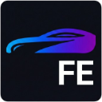

# Fleets Enhanced

<p align="center">
  
</p>

<p align="center">
  <strong>Eine Firefox-Erweiterung zur Verbesserung des Flottenmanagement-Portals</strong>
</p>

<p align="center">
  
  
  
</p>

---

## 📋 Übersicht

**Fleets Enhanced** ist eine Firefox-Browser-Erweiterung, die das Flottenmanagement-Portal um zusätzliche Funktionen und eine verbesserte Benutzeroberfläche erweitert. Die Erweiterung bietet ein elegantes Overlay mit Apple-inspiriertem Design, das wichtige Fahrzeuginformationen übersichtlich darstellt.

### ✨ Hauptfunktionen

- **Fahrzeug-Übersicht**: Übersichtliche Tabelle aller verfügbaren Fahrzeuge
- **Verfügbarkeits-Tracking**: Echtzeit-Anzeige der Fahrzeugverfügbarkeit mit 12-Monats-Heatmap
- **Geldwerter Vorteil**: Automatische Berechnung der 1%-Regel basierend auf Bruttolistenpreis und Antriebsart
- **Neue Fahrzeuge erkennen**: Automatische Markierung neu hinzugefügter Fahrzeuge
- **Sortierung & Filterung**: Flexible Sortieroptionen für alle Spalten
- **Direkter Zugriff**: Klick auf Kennzeichen öffnet Fahrzeug-Details

---

## 🖼️ Screenshots

| Hauptübersicht | Verfügbarkeits-Heatmap | Geldwerter Vorteil |
|----------------|------------------------|---------------------|
|  |  |  |

---

## 🚀 Installation

### Temporäre Installation (Entwicklung)

1. Firefox öffnen und `about:debugging` in die Adressleiste eingeben
2. "Dieser Firefox" auswählen
3. "Temporäres Add-on laden..." klicken
4. Die `manifest.json` Datei aus dem Projektordner auswählen

### Dauerhafte Installation

1. Die `.zip`-Datei in `.xpi` umbenennen
2. In Firefox auf das Menü klicken → Add-ons und Themes
3. Zahnrad-Icon → "Add-on aus Datei installieren..."
4. Die `.xpi`-Datei auswählen

---

## 📖 Verwendung

### Overlay öffnen

Nach der Installation erscheint das Overlay automatisch auf der Flottenmanagement-Seite. Es kann über den Button oben rechts minimiert/maximiert werden.

### Interaktive Elemente

| Element | Aktion | Beschreibung |
|---------|--------|--------------|
| **Kennzeichen** | Klick | Öffnet das Fahrzeug-Detail-Modal |
| **Verfügbarkeit** | Klick | Zeigt 12-Monats-Heatmap der Verfügbarkeit |
| **Leasingrate** | Klick | Zeigt Bruttolistenpreis und geldwerten Vorteil |
| **Spaltenüberschriften** | Klick | Sortiert die Tabelle nach dieser Spalte |
| **Scannen-Button** | Klick | Aktualisiert die Fahrzeugliste |

### Verfügbarkeits-Status

| Badge | Bedeutung |
|-------|-----------|
| 🟢 **Frei** | Fahrzeug ist ab sofort verfügbar |
| 🟢 **Frei (XM)** | Fahrzeug ist X Monate am Stück frei |
| 🟡 **Ab DD.MM** | Fahrzeug ist ab diesem Datum verfügbar |
| 🔴 **Blockiert** | Fahrzeug ist bis Vertragsende nicht verfügbar |

### Geldwerter Vorteil (1%-Regel)

Die Berechnung erfolgt automatisch basierend auf:

| Antriebsart | Bruttolistenpreis | Steuersatz |
|-------------|-------------------|------------|
| Elektro | ≤ 70.000 € | **0,25%** |
| Elektro | > 70.000 € | **0,5%** |
| Plug-in-Hybrid | — | **0,5%** |
| Verbrenner | — | **1,0%** |

---

## 🎨 Design

Das Interface folgt Apple's Design-Richtlinien:

- **Glassmorphism**: Subtile Transparenz und Blur-Effekte
- **SF Pro Font**: System-native Typografie
- **8-Point Grid**: Konsistente Abstände
- **Gradient Badges**: Blau-türkiser Farbverlauf für Kennzeichen
- **Smooth Animations**: Sanfte Übergänge und Hover-Effekte

### Farbpalette

```css
--primary:    #007AFF  /* Apple Blue */
--success:    #34C759  /* Grün - Frei */
--warning:    #FF9500  /* Orange - Teilweise */
--danger:     #FF3B30  /* Rot - Blockiert */
--gradient:   linear-gradient(135deg, #3478f6 0%, #00c7be 100%)
```

---

## 📁 Projektstruktur

```
fleets-enhanced/
├── manifest.json           # Extension-Manifest (v2)
├── README.md               # Diese Datei
│
├── scripts/
│   ├── content_script.js   # Haupt-Logik (DOM, API, UI)
│   └── background.js       # Service Worker
│
├── styles/
│   └── overlay.css         # Alle Styles
│
├── icons/
│   ├── icon-48.png
│   ├── icon-96.png
│   ├── icon-128.png
│   └── logo.png
│
├── popup.html              # Browser-Action Popup
└── popup.js                # Popup-Logik
```

---

## 🔧 Technische Details

### API-Endpunkte

Die Erweiterung nutzt folgende API-Endpunkte:

| Endpunkt | Methode | Beschreibung |
|----------|---------|--------------|
| `/api/pool/booked-days` | POST | Verfügbarkeits-Daten |
| `/api/pool/car-details` | POST | Fahrzeug-Details (BLP, Antrieb) |

### Datenspeicherung

- **browser.storage.local**: Persistente Speicherung der Fahrzeugdaten
- **Diffing-Algorithmus**: Erkennt neue Fahrzeuge durch Vergleich mit gespeichertem Stand

### Sicherheit

- ✅ Keine `innerHTML` - Alle DOM-Manipulationen über sichere Methoden
- ✅ Input-Sanitization für alle Benutzerdaten
- ✅ CSP-konform

---

## 📝 Changelog

### v2.0.0 (aktuell)
- ✨ Kennzeichen klickbar → öffnet Fahrzeug-Detail-Modal
- ✨ Kennzeichen-Formatierung (DCG5128E → D-CG-5128E)
- ✨ Geldwerter Vorteil Popup bei Klick auf Leasingrate
- ✨ Deutsche Antriebsart-Übersetzungen
- ✨ Verfügbarkeits-Spalte mit Echtzeit-Status
- ✨ 12-Monats-Heatmap bei Klick auf Verfügbarkeit


### v1.0.0
- 🚀 Initiale Version
- ✨ Basis-Scraping und Overlay

---

## 🤝 Mitwirken

Beiträge sind willkommen! Bitte erstelle einen Pull Request oder öffne ein Issue.

1. Fork des Repositories
2. Feature-Branch erstellen (`git checkout -b feature/AmazingFeature`)
3. Änderungen committen (`git commit -m 'Add some AmazingFeature'`)
4. Branch pushen (`git push origin feature/AmazingFeature`)
5. Pull Request öffnen

---

## 📄 Lizenz

Dieses Projekt ist unter der MIT-Lizenz lizenziert. Siehe [LICENSE](LICENSE) für Details.

---

## 👤 Autor

**Tim W.**

- GitHub: [@Cheswick](https://github.com/CheswickDEV)

---

<p align="center">
  Made with ❤️ for better fleet management
</p>
